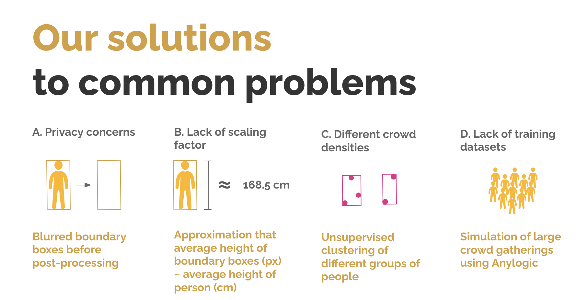
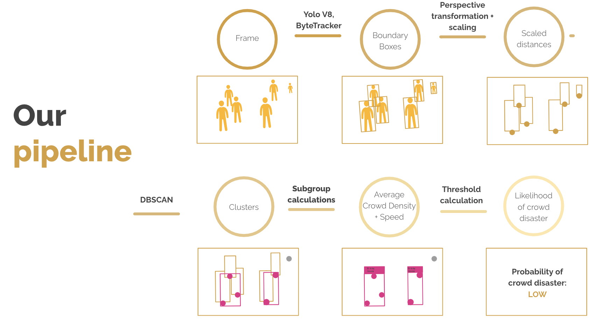

# AI4GoodLab 2024 - Team PANDO

# Table of Contents
* [Team PANDO](#team-members)
* [Project Description](#project-description)
* [Project Demo](#project-demo)
* [Ethical Considerations](#ethical-considerations)
* [Future Directions](#future-directions)
* [References](#references)
* [Contact Us](#contact-us)

# Team PANDO
* **P**earl Park
* **A**yesha Halim
* **N**azanin Mehregan 
* **D**orothy Lee
* **O**livia Langhorne

# Project Description
## The problem:
* Crowd Disaster: A dangerous phenomenon where high-density crowds lead to severe injuries or fatalities due to compressive asphyxia and trampling
* Possibility of crowd disasters are prevalent in large crowd gatherings both indoor and outdoors during events such as concerts or sports, etc.
* Many of these disasters can be prevented by careful planning and intervention by event organizers, governement agencies, etc.

### Q: Is there a way to predict these potential crowd disasters beforehand to avoid these tragedies?
**A: We aimed to predict crowd disaster potentials using surveillance camera footages using crowd density and flow rate within distinct clusters of people**

# Anylogic Simulation

# Figma Prototype
https://github.com/dodorlee1210/CrowdGuard/assets/123223901/00a3c1bf-8d40-4d4f-9220-82183d682b53

# Project Demo
(demo video/images)

# Ethical Considerations
* Usage of global height as scaling factor: there may be bias and inaccuracies with distance measurement in different regions of the world where the average height is much taller or shorter than the global average height used (168.5 cm).
* Based on the accuracy of people detection using yolov8, perhaps the training might detect certain groups of different ethnicity, race, age, etc. much better than others

# Future Directions
* Mobile deployment for public usage
* Interactive maps for indoor, semi-outdoor, and outdoor venues/locations
  *   Better navigation to & visualization of crowd gathering locations & surrounding areas
* Combine behavioral analysis
  *   Influence of emotions => social movements, parades
  *   Movement patterns
* Integrate IoT devices
  *   Sensors for crowd density meters, smart barriers, and wearable devices for attendees => provide additional real-time data 
* Enhanced predictive algorithms
  *   Further image preprocessing techniques to allow for more accurate results on different videos (low resolution, night, day) with the YOLO v8 model
  *   Better scaling factor decision base on objects of known dimensions
  *   If possible, get more info on the orientation of the surveillance camera

# References
1. Chang, J., Jung H. & Park, W. (2024). Development of a risk space prediction model based on CCTV images using deep learning: Crowd collapse. International Journal on Advanced Science Engineering Information Technology, 14(1). ISSN: 2088-5334
2. Joseph, J. V. (2022, January 2). Monitor social distancing using python, Yolov5, opencv. Medium. https://medium.com/@joicejoseph/monitor-social-distancing-using-python-yolov5-opencv-78d72c675f5b 
3. Haghani, M., Coughlan, M., Crabb, B., Dierickx, A., Feliciani, C., van Gelder, R., Geoerg, P., Hocaoglu, N., Laws, S., Lovreglio, R., Miles, Z., Nicolas, A., O'Toole, W. J., Schaap, S., Semmens, T., Shahhoseini, Z., Spaaij, R., Tatrai, A., Webster, J., & Wilson, A. (2023). A roadmap for the future of crowd safety research and practice: Introducing the Swiss Cheese Model of Crowd Safety and the imperative of a Vision Zero target. Safety Science, 168, 106292. https://doi.org/10.1016/j.ssci.2023.106292
4. Kim, T., Lan, J. & Lee M. (2023). CrowdStop: Preventing crowd disasters [PowerPoint slides]
5. Yogameena, B., & Nagananthini, C. (2017). Computer vision based crowd disaster avoidance system: A survey. International Journal of Disaster Risk Reduction, 22, 95-129. https://doi.org/10.1016/j.ijdrr.2017.02.021
6. Tschechne, M. (2022). Nine Per Square Meter. Max Planck Research Editorial (2), 33-37. https://www.mpg.de/19124742/F002_Focus_032-037.pdf
7. Moussaïd M, Perozo N, Garnier S, Helbing D, Theraulaz G (2010) The Walking Behaviour of Pedestrian Social Groups and Its Impact on Crowd Dynamics. PLoS ONE 5(4): e10047. https://doi.org/10.1371/journal.pone.0010047

    

# Contact Us
* If you have any questions or concerns, feel free to contact us via **pandoai4good@gmail.com**!

